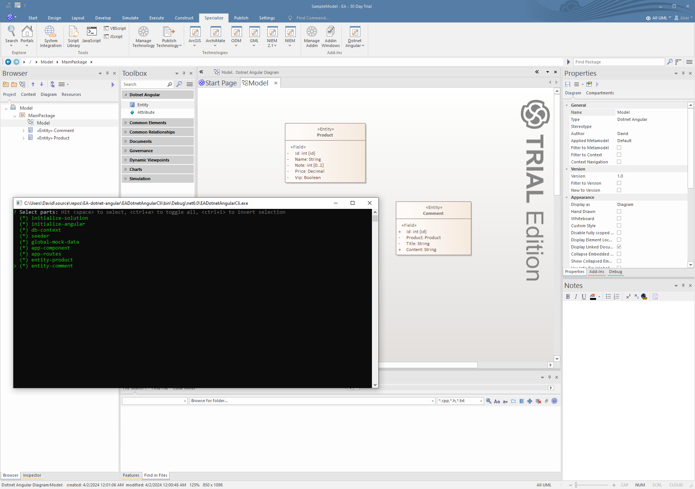
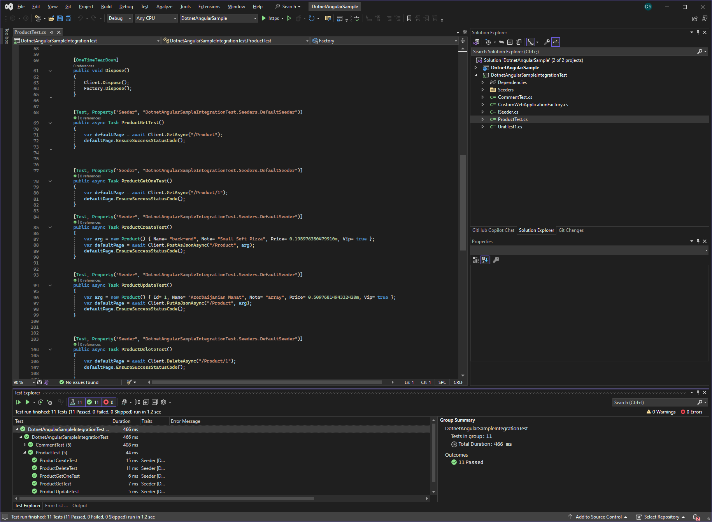
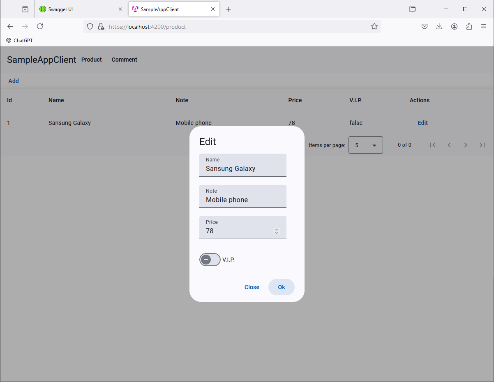

<h1 align="center">Welcome to Enterprise Architect Dotnet Angular Generator👋</h1>

  

A source code generator for Enterprise Architect that creates a test-driven, development-ready .NET Angular CRUD application from a UML model. It also generates integration tests for both the API and Angular components, using Autobogus to auto-generate fake data. Inspired by the JHipster and Yellicode bookstore tutorials, the generator is minimalist and designed to be easily customized for your own model-driven generation technology.

### 🏠 [Homepage](https://github.com/david-skalka/EA-dotnet-webapi)

## Screenshots

### Enteprise architect model

### Api development environment ( integration tests )

### Generated application

## Motivation

Model-Driven Development (MDD) generators enhance productivity, improve code quality, and foster better collaboration and communication. By leveraging MDD generators, development speed can be accelerated by 2 to 5 times or more compared to traditional software development approaches.

### Benefits of Custom Code Generator
- Tailored Solutions: Custom code generators can be tailored specifically to the needs of a particular project or organization, providing greater flexibility and customization options.
- Optimized Code: With custom code generators, developers have more control over the generated code, allowing for optimization of performance, scalability, and maintainability based on project requirements.
- Integration with Existing Systems: Custom code generators can be seamlessly integrated with existing systems, ensuring smoother transitions and better compatibility with legacy infrastructure.

## Features
- Generate integration tests.
- Generate Storybook cases.
- Generate seed and mock data using AutoBogus
- Simple and modifiable.
- Fast t4 template development in unit test.

## Primitive types
- Integer
- Text
- Decimal
- DateTime
- Bool

## Prerequisites
- EA 16 (x64)
- net8.0
- npm
- Imported `data\Mdg\MdgDotnetWebapi.xml` techonolgy file for new project ( The sample already has an imported MDG technology )

## Example
1.  run EADotnetAngularGen.exe -d Output -f "..\..\..\Data\SampleModel.qea" -n SampleApp
2. Run generated solution in Visual studio

## Usage
  

    
Define the Domain Model Using a Class Diagram

    Identify Main Data Entities: Extract key entities (e.g., users, products, orders) from the business specifications.
    Understand Attributes and Relationships: Analyze their attributes, relationships, and necessary operations.
    Add stereotypes to @UMLModel ( ReactCoreGen ), @UmlClass ( Entity ), Attributes ( Field ). Fill in their tags accordingly.
  

  

    
Initialize the Project

    Generate the Application: Navigate to the menu (Specialize > Dotnet Webapi) and follow the steps to generate the entire application.
  

  

    
Customization

    Create Prototype: Focus on entity relationships and validate them. Specify Action Behavior: Customize the specified actions, then make minor UI changes. Code Merging: Be cautious with full customizations before modifying the UML model.
  

  

  
Continuous Application Updates

    Version Control: Utilize version control systems to merge new UML model changes into the customized application.
  

  

    
Test-Driven Development (TDD)

    Utilize execution tests to customize API actions instead of using Swagger UI or the React client. For insights into the TDD application, refer to the test coverage report, which provides valuable information about the application's architecture and its test cases.
    Benefits: TDD facilitates faster development and enhances code quality by making refactoring easier. It ensures that bugs are detected and resolved early, resulting in a more robust and maintainable codebase.
  

    

  
Deploying the Application Using Continuous Deployment (CD)

Test Execution: It is critical to execute tests using a continuous integration server (e.g., GitHub Actions) to ensure all tests in the repository pass. Disable application deployment unless all tests succeed.
    

## Roadmap
- Many to many relation

## How to modify for your owen MDG technology
1. Execute t4 template by `ApiTemplatesTest` or `ClientTemplatesTest`.cs using test runner and check output in console ( faster development time )
2. Integrate your t4 template to EADotnetWebapiCli as command

## Author

👤 **David Skalka**

## Show your support

Give a ⭐️ if this project helped you!

***
_This README was generated with ❤️ by [readme-md-generator](https://github.com/kefranabg/readme-md-generator)_
